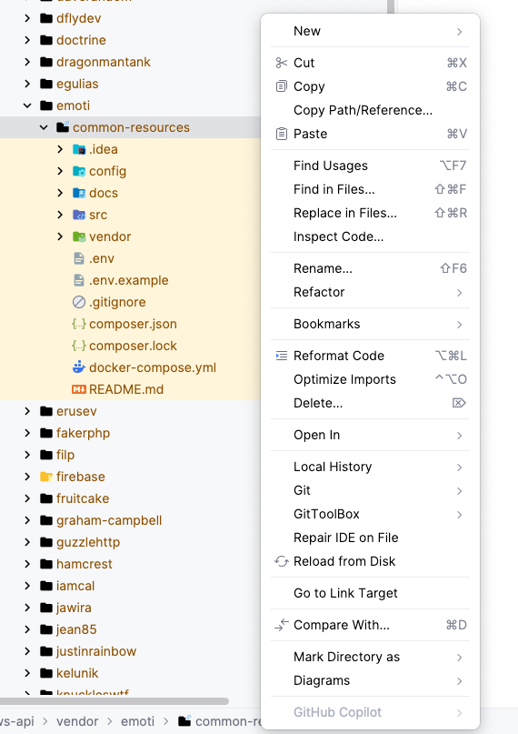

# Shared Services and Network with Docker Compose

This project provides a shared set of services and a common Docker network that can be used by other local projects. It
is designed to streamline development by centralizing commonly used services and providing an easy way to connect
different projects on the same Docker network.

## Features

- **[Shared docker network broker](docs/shared-network.md)**: A shared network (`common-resources-network`) that allows
  local projects to communicate
  with each other.
- **[Message broker](docs/message-broker.md)**: Events that you can send and consumer to handle them.
- **Shared Services**: Preconfigured services that can be reused across projects.

## Included Services

Services provided here are for development purposes only and should not be used in production.

| Service           | Shared network URL                    | GUI                     |
   |-------------------|---------------------------------------|-------------------------|
| **RabbitMq**      | common-resources-rabbitmq-1:5672      | http://localhost:15672  |
| **Elasticsearch** | common-resources-elasticsearch-1:9200 | https://elasticvue.com/ |

## Getting Started

### Prerequisites

- [Docker](https://www.docker.com/get-started) installed on your system.
- [Docker Compose](https://docs.docker.com/compose/) installed.

### Usage

1. #### Clone this repository
   ```bash
   git clone git@ssh-gitlab.emoti.dev:emoti/gifts/common-resources.git
   cd common-resources
   cp .env.example .env
   ```
2. #### Start the shared services:
   ```bash
   docker-compose up -d
   ```

## Local development

The best way to develop this package is to install it as a symlink in another project.
This way we'll have the latest package code available immediately, without having to copy and paste anything.

1. Place the `common-resources` directory next to your other projects
   ```
   - Users
     - jan_kowalski
       - projects
         - common-resources
         - agcore
         - gifts-api
         - reviews-api
    ```
2. Link the `common-resources` directory to the docker container of your project (_docker.compose.yml_)
    ```yaml
    services:
      app:
        volumes:
          - ../common-resources:/var/www/common-resources:rw
      ```

   Alternatively, you can link the package dynamically when starting the container from a custom image:
    ```bash
   docker run -itd --name reviews-api \\n
    -p 8100:80 \\n
    -v "/Users/jan_kowalski/projects/common-resources":/var/www/common-resources \\n
    registry.gifts.emoti.pl:5000/php_base_image_laravel:php8.4
   ```
3. Specify the symlink repository (_composer.json_)
   ```json
   "repositories": [
       {
           "type": "path",
           "url": "../common-resources",
           "options": {
               "symlink": true
           }
       }
   ]
   ```
4. Install the package
   ```bash
   composer require emoti/common-resources:@dev
   ```

**Disclaimer!**<br>
Please note that though your project already has the newest code, your IDE could see outdated one, till you don't
refresh it
manually by clicking **Reload from disk** on the _vendor/emoti_ directory.<br>
But even then it could take a while for your IDE to see the newest changes. Sometimes it don't help at all and you have
to find another solution like triggering the project reindex, or just waiting a couple of minutes.<br>
But remember that it's only an IDE issue. Your PHP code can run with the newest changes immediately.<br>
